# AD Query

A Windows desktop app for running **granular, ad-hoc queries against Active Directory / LDAP** and exporting exactly the fields you want to **CSV**.

Pick an object type, narrow it with a filter, choose *any* attributes as columns (last logon, account flags, group membership, ACLs…), run it, and export the rows/columns you care about.

> **Running it?** See **[docs/BETA.md](docs/BETA.md)** for install, connecting, data handling, and known limits. Full product spec, stack rationale, and roadmap are in **[docs/PRD.md](docs/PRD.md)**.

## Screenshots

Connect (auto-detects your domain → sign in as you, no password) and the results "ledger":

| Connect | Results |
|---|---|
|  | 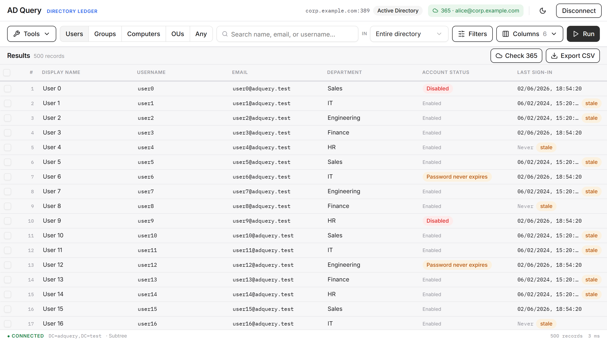 |

| Filters | Inspect (attributes + ACL) | Accurate last login (all DCs) | Risk flags |
|---|---|---|---|
| 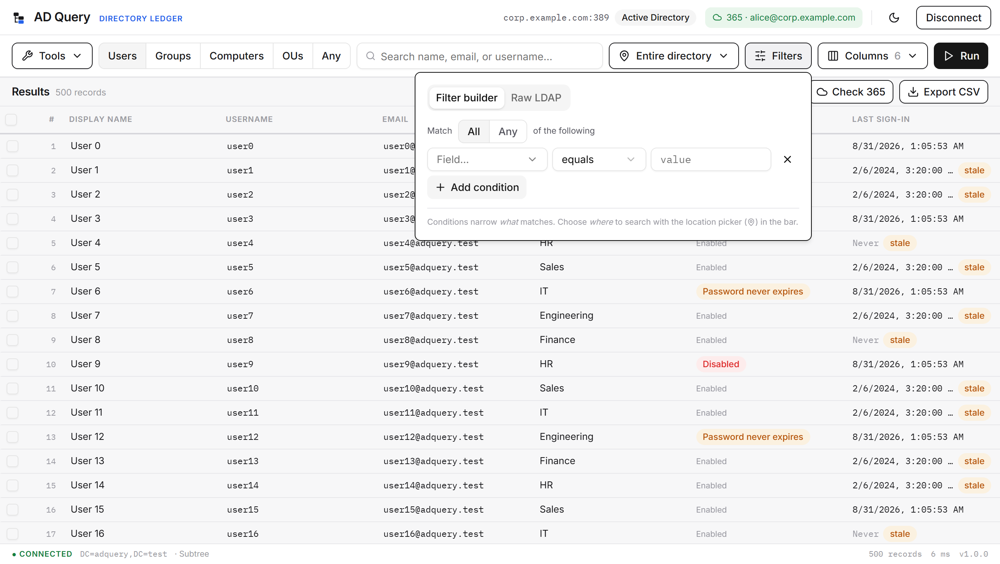 | 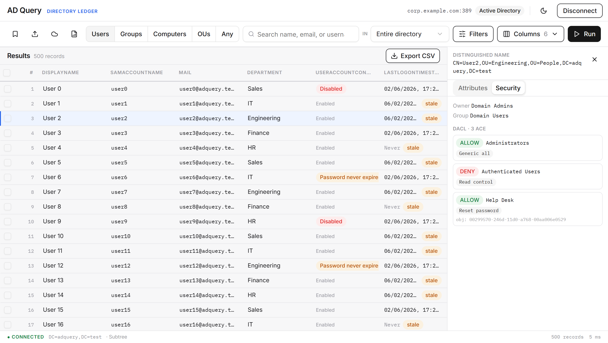 | 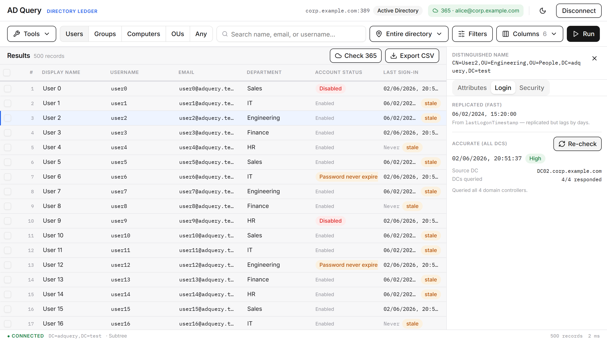 | 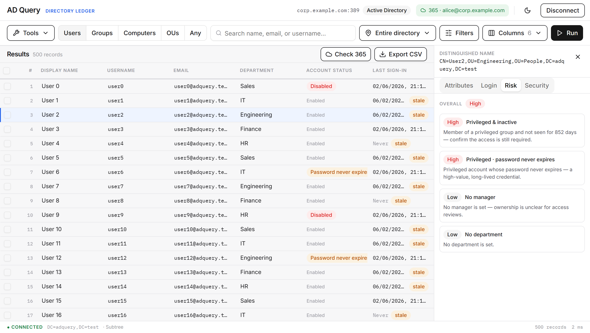 |

| Bulk lookup from CSV/Excel | Export | Dark theme |
|---|---|---|
| 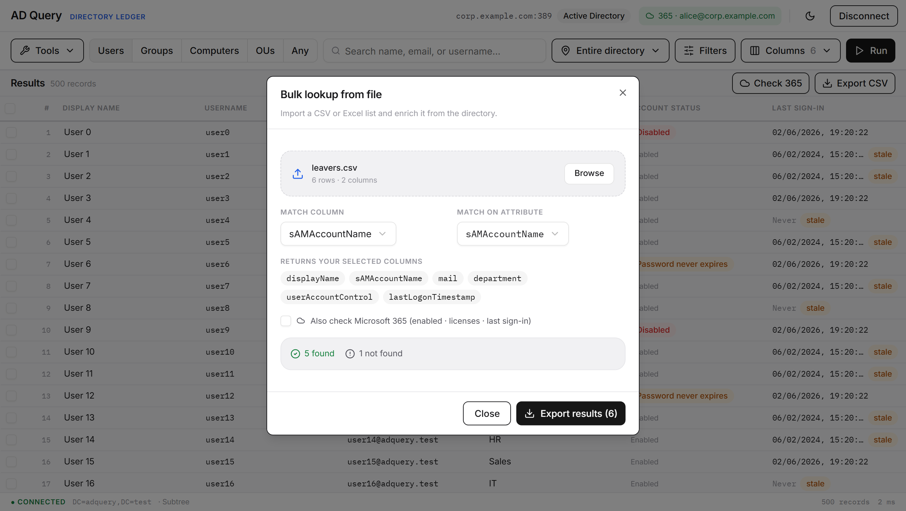 | 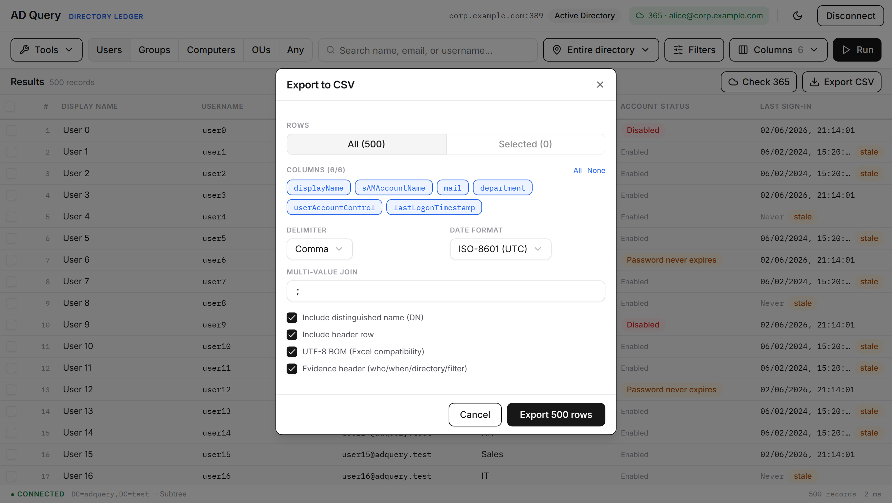 | 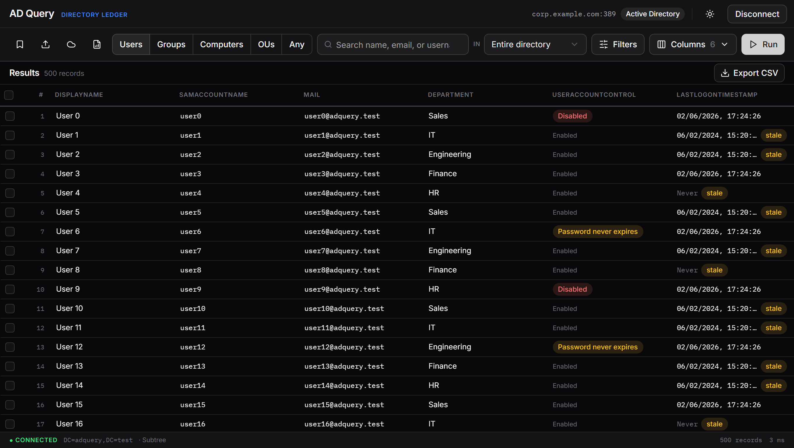 |

Reports: one-click run/download recipes, **unused-license reclamation** (licensed users dormant in AD *and* 365), stale-account review, and Microsoft 365 sign-in:

| Reports | Privileged access | Licenses & sign-in | Stale accounts | 365 sign-in |
|---|---|---|---|---|
| 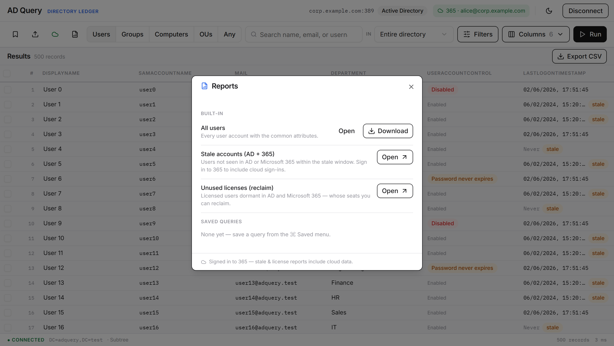 | 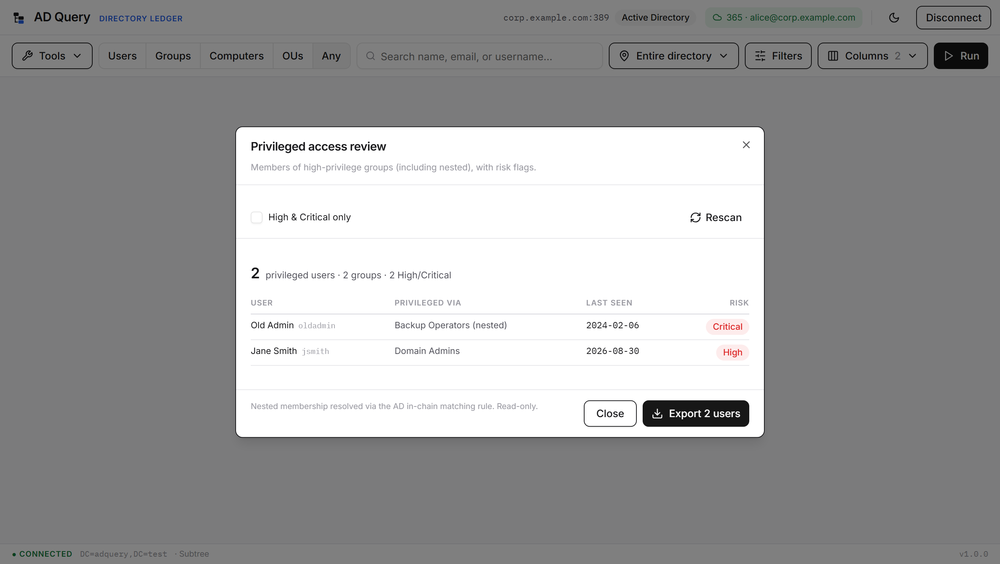 | 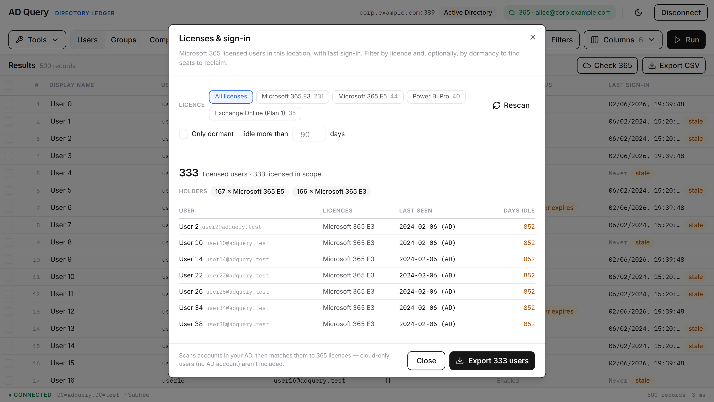 | 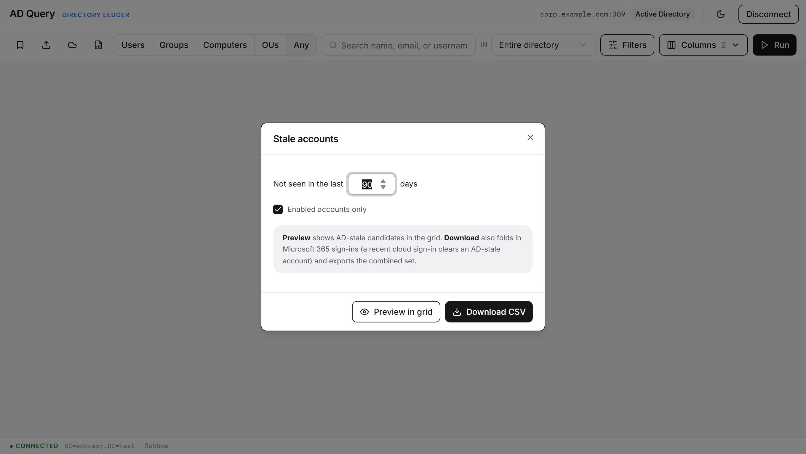 | 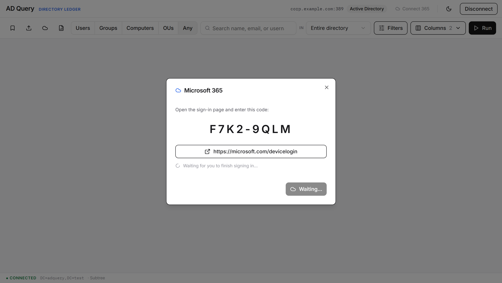 |

> Regenerate with `cd app/frontend && npm run shots` (builds the app, serves it, and drives the journey via Playwright into `docs/screenshots/`).

## Stack

- **Wails v2** desktop shell (Go ↔ WebView2)
- **Go 1.26** backend: `go-ldap/ldap/v3`, streaming CSV, AD type decoders
- **React 18 + TypeScript + Vite** frontend, Tailwind + TanStack Table

## Layout

```
app/            Wails application (Go backend + React/TS frontend)
docs/           PRD and design docs
test/openldap/  Dockerized OpenLDAP test directory + seed LDIF
test/samba-ad/  Dockerized real Active Directory DC (KDC) for AD-mode + Kerberos
```

## Authentication

- **Password**: simple bind (DN/UPN + password). Works against any LDAP/AD; used for the test directories.
- **Windows SSO**: SASL GSSAPI over SSPI: binds as the **current logged-in Windows user** with no prompt. Requires a domain-joined machine.
- **Kerberos**: explicit-credential GSSAPI against a named KDC (cross-platform; what the Samba AD test directory validates).

## Quick start (development)

### 1. Start the test directory

```powershell
cd test/openldap
docker compose up -d
```

This brings up OpenLDAP seeded with sample users/groups/OUs/computers:

- **URL:** `ldap://localhost:3389` (LDAPS on `6636`)
- **Base DN:** `dc=adquery,dc=test`
- **Bind DN:** `cn=admin,dc=adquery,dc=test`
- **Password:** `AdminPass123!`
- Sample user password (all users): `Passw0rd!`
- Optional web UI: phpLDAPadmin at <http://localhost:8082>

### 2. Run the app

```powershell
cd app
wails dev
```

## Install

Grab `ADQuery-x.y.z-x64-setup.exe` from the [latest release](https://github.com/edwynmoss/ad-query/releases/latest). It installs for your account only (no administrator prompt) and adds a Start menu entry. From 1.0.0 the app checks for a newer release a few seconds after launch and while it stays open, and offers it in a toast; **Check for updates** is in the Tools menu. Installers are signed with the project's release key and verified before they run.

The installer is not yet code-signed for Windows SmartScreen, so expect a prompt on first launch.

## Build a release locally

```powershell
cd app
wails build -nsis -ldflags "-X main.Version=1.0.0"   # app/build/bin/AD Query-amd64-installer.exe
```

Needs NSIS (`makensis`) on the PATH. The icon set and installer artwork are generated from the mark by `python scripts/installer-art.py`; the same geometry is drawn inline by `app/frontend/src/components/Mark.tsx`.

Tagging `vX.Y.Z` runs the release workflow: it stamps the version, builds and signs the installer, writes the update manifest, and opens a draft release with notes from `docs/releases/vX.Y.Z.md`. Publishing the draft is what makes installed copies start offering the update.

## Testing

```powershell
cd app && go test ./...              # backend (incl. the read-only guard)
cd app/frontend && npx vitest run    # lib unit + UI component tests
```

The **read-only guarantee** (`app/readonly_guard_test.go`) is enforced by the
test suite: the build fails if any LDAP write or non-GET Graph call is ever
introduced.

CI runs the same suite on every pull request. A `.githooks/pre-push` hook can
run it locally before any push as well. Enable it once per clone:

```powershell
git config core.hooksPath .githooks
```

## Requirements

- Go 1.26+, Node 20+, Wails CLI (`go install github.com/wailsapp/wails/v2/cmd/wails@latest`)
- Docker (for the test directories)
- WebView2 runtime (preinstalled on Windows 11)
